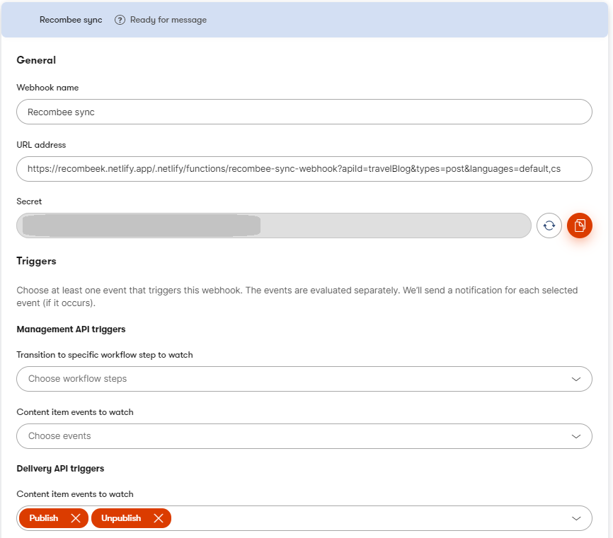
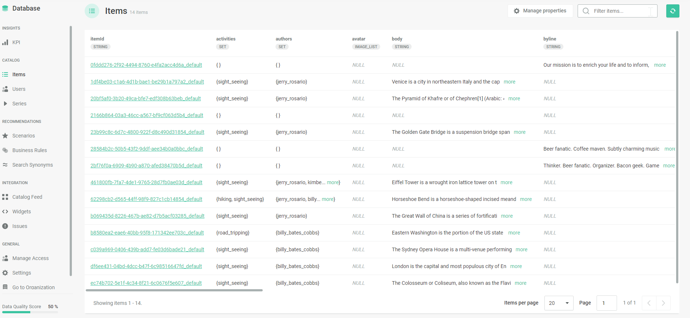

[![Core integration][core-shield]](https://kontent.ai/integrations/recombee)
[![Gallery][gallery-shield]](https://kentico.github.io/kontent-custom-element-samples/gallery/)

![Last modified][last-commit]
[![Issues][issues-shield]][issues-url]
[![Contributors][contributors-shield]][contributors-url]
[![Forks][forks-shield]][forks-url]
[![MIT License][license-shield]][license-url]

[![Stack Overflow][stack-shield]](https://stackoverflow.com/tags/kentico-kontent)
[![GitHub Discussions][discussion-shield]](https://github.com/Kentico/Home/discussions)

<p align="center">
<image src="docs/01-kk-logo-main.svg" alt="kontent logo" width="250" style="vertical-align: middle;"/>
<image src="docs/recombee-logo.png" alt="recombee logo" width="350" style="vertical-align: middle;" >
</p>

<p align="center">
  <a href="#demo">Demo</a> •
  <a href="#prerequisities">Prerequisities</a> •
  <a href="#get-started">Get started</a> •
  <a href="#recombee-data-structure">Recombee data structure</a> •
  <a href="#getting-recommendations">Getting recommendations</a> •
  <a href="#developing">Developing</a> •
  <a href="#contributors">Contributors</a> •
  <a href="#license">License</a> •
  <a href="#additional-resources">Resources</a>
</p>

This repository contains an _example implementation_ of integration between [Recombee](https://www.recombee.com/) AI-powered content personalization and recommendation engine, and [Kentico Kontent](https://kontent.ai/) headless CMS. It comes with an optional [custom element](https://docs.kontent.ai/tutorials/develop-apps/integrate/content-editing-extensions) for indexing your content in Recombee, as well as **two** [Netlify functions](https://docs.netlify.com/functions/overview/) for the **initial setup** and subsequent **processing of content changes** via a [webhook](https://docs.kontent.ai/tutorials/develop-apps/integrate/webhooks).


## Demo


## Prerequisities
To run this integration, you'll need your Kentico Kontent project + a [Recombee account](https://account.recombee.com/users/sign_up). 

**[Contact Recombee](mailto:business@recombee.com) to recieve a special offer for Kontent customers!**

## Get Started

1. ### Quick Deploy
    Netlify has made this easy. If you click the deploy button below, it will guide you through the process of deploying it to Netlify and leave you with a copy of the repository in your account as well.

    [](https://app.netlify.com/start/deploy?repository=https://github.com/Kentico/kontent-example-integration-recombee)

    After you deploy the project into Netlify, you'll find two functions there:
    
    1. **recombee-init-function** is the function that imports or refreshes all content of selected content type from Kontent into Recombee.
    2. **recombee-sync-webhook** is the function you want to call via a webhook from Kontent to notify the integration that there's been a change to your content and that Recombee database has to be potentialy updated.

2. ### Create a new Webhook in Kontent to Sync your data with Recombee
    The next step is [creating a new webhook in Kentico Kontent](https://docs.kontent.ai/tutorials/develop-apps/integrate/webhooks#a-create-a-webhook). 

    Fill out the following into the webhook's **URL address** field:

    {**recombee-sync-webhook endpoint URL**}?apiId={**Recombee API Identifier**}&types={**kontent content types to be processed by the webhook**}&languages={**kontent languages to be processed by the webhook**}

    You can include multiple kontent types and languages the webhook will be looking out for and synchronizing - to do so, just include them as a comma-separated list.

    Subsequently, set the Kontent's **Delivery API triggers** to watch for _Publish_ and _Unpublish_ of your content items. 

    At the end, this is an example of how your webhook might look like:

    

    Save the webhook and copy the generated **secret** as it would be required as a parameter in the following step.

3. ### Configure your Netlify functions

    To **setup** both function, all you need to do is set the following **[environment variables](https://docs.netlify.com/configure-builds/environment-variables/)** for your Netlify site. 

    Variable | Value |
    --- | --- |
    RECOMBEE_API_KEY |  your [Recombee private token](https://docs.recombee.com/authentication.html) | 
    KONTENT_SECRET | your [Kontent webhook secret](https://docs.kontent.ai/tutorials/develop-apps/integrate/webhooks#a-validate-received-notifications)

    The Recombee private key is used by the function to synchronize your recommendation database.

    The Kontent webhook secret is used to ensure integrity of the webhook payload. It has been created in the previous step.

    After your function has been redeployed (or your environment variables has been propagated), the functions are ready to be called. 
    
    You can observe the real-time **Function log** on the same screen you'd find your function's endpoint (_Functions_ -> _your function_). 

4. ### Register a content type into your Recombee database
    The initialization of your Recombee recommendation database with your content is done through the **recombee-init-function**. Simply make a POST request towards the function's endpoint URL with the following payload:

    ```
    {
      "projectId":"{Kontent's project ID}",
      "language":"{Kontent's language codename}",
      "contentType":"{Kontent's content type codename}",
      "recombeeDb":"{Recombee's api id}",
    }
    ```
    The function processes all **published** content of the given content type and language from your project and creates or updates your recommendation database in Recombee. 

    _Please keep in mind, that this example integration does not fully support modular content, i.e. it only includes codenames of linked items, not the whole content structure and subsequent links as it makes sense to choose mostly flat types for recommendations (i.e. articles, blogposts, ...)._

    ---

    ### Alternatively use a **custom element** to manage your registered content types

    Simply add a new [custom element]((https://docs.kontent.ai/tutorials/develop-apps/integrate/content-editing-extensions)) into your content model (it will be a good idea to create some kind of _meta_ content type to store some of the project's settings, including this element). 

    Use your netlify's URL for the base page as the **Hosted code URL** and a following settings to setup the custom element:

    ```
    {
      "recombeeAppId": "{Recombee's app id}",
    }
    ```
    The custom element allows you to (re)register your content types into your Recombee database. It also saves codenames of types you have already registered through it. <a href="#demo">**Check out the demo gif above!**</a>
    
    If you are working with content in [multiple language variants](https://docs.kontent.ai/tutorials/write-and-collaborate/create-multilingual-content/translate-content-items), adding additional variants to Recombee is just as easy as just simply switching to the desired language variant and registering the content type through a custom element included in that variant. 

    _Please note, that the element actually stores the types that have been registered in Recombee as its value, so if you use it in multiple places, it might not display the registered content types correctly._

## Recombee data structure
In order to process data from Kontent and save them into Recombee, the functions map your elements from Kontent directly into Recombee under the same name. The linked items are saved as a set (array) of codenames. Every item will also have **codename**, **type**, **language**, **collection**, and **last_modified** properties on top of the specific elements. Knowing the structure of your data will allow you to use the full potential of [Recombee's filtering and boosting features](https://docs.recombee.com/reql.html). 


You can sync multiple content types with one Recombee database, however, it is suggested to use types similar in nature, i.e. blogposts and case studies together would be fine, products and articles on the other hand would not be the prefered way to use the engine. If you need help with your use-case, feel free to contact us on our [Discord](https://bitly.com/kontent-discord), or reach out to [Recombee directly](mailto:business@recombee.com).   



## Getting recommendations
There are multiple ways to get the recommendations for your website once you are all setup. Please refer to [Recombee documentation](https://docs.recombee.com/gettingstarted.html#get-recommendations) for further instructions.


## Developing
[Netlify Dev](https://www.netlify.com/products/dev/) is highly recommended for local development. 

```bash
# Initial project setup
$ npm install

# Build the project
$ npm run build

# Run locally
$ netlify dev
```

## Contributors
We have collected notes on how to contribute to this project in [CONTRIBUTING.md](CONTRIBUTING.md).

<a href="https://github.com/Kentico/kontent-example-integration-recombee/graphs/contributors">
  
</a>

## License

[MIT](https://tldrlegal.com/license/mit-license)

## Additional Resources

- [Custom Element Gallery on github](https://kentico.github.io/kontent-custom-element-samples/gallery/)
- [Kentico Kontent's Integration documentation](https://docs.kontent.ai/tutorials/develop-apps/integrate/integrations-overview)


[last-commit]: https://img.shields.io/github/last-commit/Kentico/kontent-example-integration-recombee?style=for-the-badge
[contributors-shield]: https://img.shields.io/github/contributors/Kentico/kontent-example-integration-recombee.svg?style=for-the-badge
[contributors-url]: https://github.com/Kentico/kontent-example-integration-recombee/graphs/contributors
[forks-shield]: https://img.shields.io/github/forks/Kentico/kontent-example-integration-recombee.svg?style=for-the-badge
[forks-url]: https://github.com/Kentico/kontent-example-integration-recombee/network/members
[stars-shield]: https://img.shields.io/github/stars/Kentico/kontent-example-integration-recombee.svg?style=for-the-badge
[stars-url]: https://github.com/Kentico/kontent-example-integration-recombee/stargazers
[issues-shield]: https://img.shields.io/github/issues/Kentico/kontent-example-integration-recombee.svg?style=for-the-badge
[issues-url]: https://github.com/Kentico/kontent-example-integration-recombee/issues
[license-shield]: https://img.shields.io/github/license/Kentico/kontent-example-integration-recombee.svg?style=for-the-badge
[license-url]: https://github.com/Kentico/kontent-example-integration-recombee/blob/master/LICENSE
[core-shield]: https://img.shields.io/static/v1?label=&message=core%20integration&style=for-the-badge&color=FF5733
[gallery-shield]: https://img.shields.io/static/v1?label=&message=extension%20gallery&style=for-the-badge&color=51bce0
[stack-shield]: https://img.shields.io/badge/Stack%20Overflow-ASK%20NOW-FE7A16.svg?logo=stackoverflow&logoColor=white&style=for-the-badge
[discussion-shield]: https://img.shields.io/badge/GitHub-Discussions-FE7A16.svg?logo=github&style=for-the-badge
[product-demo]: docs/demo.gif?raw=true
